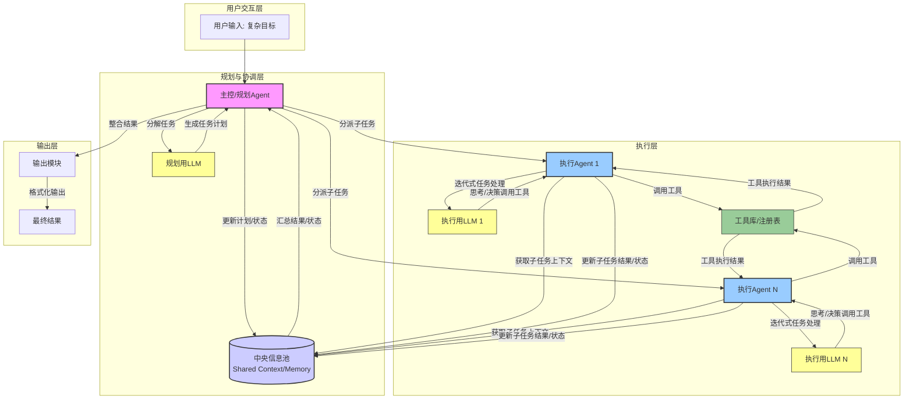
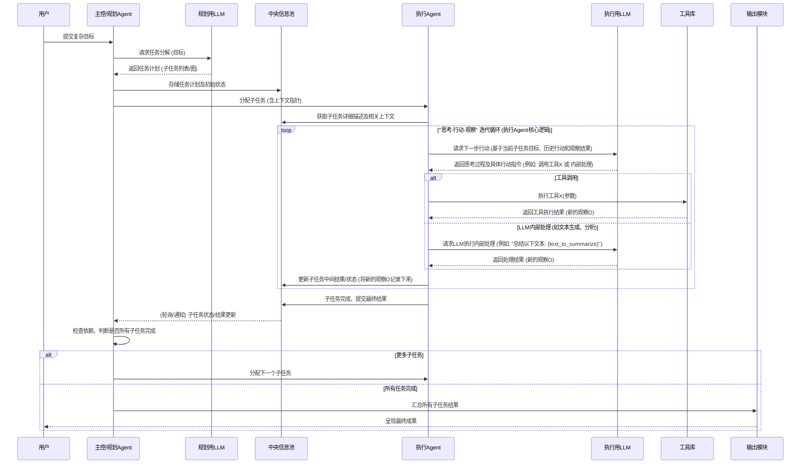

# Manus Clone

本方案旨在设计一个能够处理复杂任务的 AI Agent 系统。其核心思想是将宏观的任务规划与具体的子任务执行分离。系统包含一个中央规划器（主控/规划Agent）和多个执行代理（执行Agent）。执行代理将采用一种基于大型语言模型（LLM）进行思考、决策并调用工具的迭代工作模式，与外部环境交互以完成具体任务。一个中央信息池将用于共享状态、数据和任务进展。

## 1. 系统架构

**架构组件说明:**

*   **用户输入 (UserInput):** 用户提出的复杂目标或指令。
*   **主控/规划Agent (Orchestrator):**
    *   核心协调者。
    *   接收用户输入，调用**规划用LLM (PlannerLLM)** 将复杂目标分解为一系列有序或并行的子任务。
    *   管理任务的生命周期、依赖关系，监控整体进度。
    *   将子任务分派给合适的**执行Agent (Execution Agent)**。
    *   从**中央信息池 (CentralInfoPool)** 获取子任务状态和结果，进行汇总和决策。
*   **规划用LLM (PlannerLLM):** 一个强大的语言模型，专门用于理解复杂指令、进行任务分解和规划。
*   **中央信息池 (CentralInfoPool):**
    *   一个共享的数据存储区，所有Agent都可以访问。
    *   存储内容：
        *   全局任务计划、各子任务的描述和当前状态。
        *   子任务执行产生的中间结果和最终结果。
        *   共享的知识、数据、上下文信息。
        *   执行历史和日志。
    *   作用：促进Agent间的信息共享，避免重复工作，维护任务的全局一致性。
*   **执行Agent (Execution Agent):**
    *   负责执行具体的子任务。每个执行Agent内部包含一个**执行用LLM (ExecutorLLM)** 和一套与**工具库 (ToolLibrary)** 交互的机制，通过迭代式的“思考-行动-观察”循环来完成任务。
*   **执行用LLM (ExecutorLLM):** 用于执行Agent内部的迭代循环，指导每一步的思考和行动。
*   **工具库 (ToolLibrary):** 提供一系列可供执行Agent调用的工具，例如：
    *   `web_search(query)`: 执行网络搜索。
    *   `browse_webpage(url)`: 获取并解析网页内容。
    *   `code_interpreter(code)`: 执行代码片段 (例如Python)。
    *   `text_analyzer(text, instruction)`: 对文本进行分析、提取、总结等。
    *   `database_query(query)`: 查询数据库。
    *   (根据任务需求可扩展更多工具)
*   **输出模块 (OutputModule):** 负责将Orchestrator整合后的最终结果格式化并呈现给用户。
*   **最终结果 (FinalOutput):** AI Agent完成任务后交付的成果。

## 2. 数据流图

## 3. 任务规划阶段 (主控/规划Agent)

1.  **接收输入:** 主控/规划Agent接收用户定义的复杂目标。
2.  **任务分解:**
    *   Agent将目标传递给规划用LLM (PlannerLLM)。
    *   PlannerLLM分析目标，将其分解为一个结构化的任务计划。这个计划可能是一个线性的步骤序列，也可能是一个包含并行路径和依赖关系的图。
    *   例如，目标：“调研中国电动汽车市场并生成一份市场分析报告初稿。”
    *   PlannerLLM可能分解为：
        1.  子任务A：收集中国主要电动汽车制造商列表。
        2.  子任务B：获取这些制造商过去一年的销量数据。
        3.  子任务C：搜索关于中国电动汽车市场政策和趋势的最新新闻。
        4.  子任务D：分析收集到的数据和信息，识别关键增长点和挑战。 (可能依赖A, B, C)
        5.  子任务E：基于分析结果，撰写报告的各个章节（市场概述、主要参与者、销量分析、趋势预测、结论）。 (可能依赖D)
        6.  子任务F：整合章节，形成报告初稿。 (可能依赖E)
3.  **存储与调度:**
    *   生成的任务计划及其初始状态（如“待处理”）被存储到中央信息池。
    *   主控/规划Agent根据计划中的依赖关系和优先级，选择可执行的子任务，并将其分派给一个或多个执行Agent。

## 4. 任务执行阶段 (执行Agent)

每个执行Agent负责处理一个或多个由主控Agent分配的子任务。其核心工作机制是围绕其内部的**执行用LLM (ExecutorLLM)** 进行的一系列迭代式“思考-行动-观察”循环。

1.  **接收与理解子任务:**
    *   执行Agent从主控Agent处接收到当前需要处理的子任务描述（例如，“子任务A：收集中国主要电动汽车制造商列表”）。
    *   它会从**中央信息池 (CentralInfoPool)** 查询与该子任务相关的任何先前步骤的结果、共享数据或特定指令作为上下文。

2.  **“思考-行动-观察”迭代循环:**
    执行Agent进入一个循环，直到子任务完成或遇到无法解决的问题。每轮循环包含以下步骤：

    *   **a. 思考 (Reasoning):**
        *   执行Agent将其当前的子任务目标、所有历史行动记录、先前行动产生的观察结果以及从中央信息池获取的上下文信息，整合后作为输入，提交给其内部的**执行用LLM (ExecutorLLM)**。
        *   ExecutorLLM的角色是“大脑”。它会分析当前状态并进行推理，以决定下一步最合理的行动。
        *   这个推理过程可能包括：
            *   评估当前距离子任务目标还有多远。
            *   判断是否需要更多信息。
            *   选择最合适的工具来获取信息或执行操作。
            *   如果上一步出错，分析错误原因并规划修正方案。
        *   LLM的输出通常包含两部分：
            1.  **内部思考过程/理由 (Thought):** 一段文本，解释为什么选择下一步的行动。例如：“为了收集制造商列表，我需要使用网络搜索工具。我将搜索关键词‘中国主要电动汽车品牌’。”
            2.  **具体行动指令 (Action):** 一个结构化的指令，告诉执行Agent具体要做什么。

    *   **b. 行动 (Acting):**
        *   执行Agent解析ExecutorLLM输出的行动指令，并执行该行动。常见的行动类型有：
            *   **调用工具 (Tool Invocation):**
                *   如果指令是调用某个工具，例如 `Action: TOOL_CALL(tool_name="web_search", parameters={"query": "中国主要电动汽车品牌"})`。
                *   执行Agent会查找**工具库 (ToolLibrary)** 中注册的名为 `web_search` 的工具，并传入指定的参数（如 `"query": "中国主要电动汽车品牌"`）来执行它。
                *   工具库中的工具是预定义的函数或API接口，能够与外部世界（如互联网、文件系统、数据库）或内部功能（如代码解释器）交互。
            *   **内部LLM处理:**
                *   有时，行动可能是让ExecutorLLM（或一个专门的子LLM）直接处理某些文本信息，而不需要外部工具。例如，总结一段文字、从文本中提取特定信息、或根据已有信息生成一段新的文本。
                *   指令可能类似于：`Action: INTERNAL_LLM_PROCESS(instruction="从以下文本中提取所有公司名称：{text_content}")`。
            *   **完成子任务 (Finish):**
                *   当ExecutorLLM判断当前子任务已经圆满完成时，它会输出一个特殊的“完成”行动指令，并附带最终结果。
                *   例如：`Action: FINISH_TASK(result_summary="已收集到主要制造商列表：A, B, C...")`。

    *   **c. 观察 (Observation):**
        *   行动执行后，会产生一个结果，这个结果被称为“观察”。
        *   如果调用了外部工具，观察结果就是该工具的输出（例如，`web_search` 工具返回搜索结果的列表和摘要；`code_interpreter` 工具返回代码的打印输出或错误信息）。
        *   如果进行了内部LLM处理，观察结果就是LLM生成的文本。
        *   如果工具执行失败或遇到任何错误，观察结果应包含详细的错误信息，以便LLM在下一轮思考时能够理解并尝试纠正。
        *   这个“观察”结果会被记录下来。

    *   **d. 迭代与更新:**
        *   新的“观察”结果将作为下一轮“思考”阶段的输入之一，反馈给ExecutorLLM。
        *   执行Agent将当前子任务的进展（例如，最近的行动、观察结果、遇到的问题）更新到**中央信息池**中对应的条目下。这确保了主控Agent可以跟踪进度，并且在必要时，其他Agent也可以访问这些中间信息。
        *   循环返回到步骤 `a. 思考 (Reasoning)`，LLM会基于更新后的信息（包含了新的观察）来规划下一步。

3.  **子任务完成或失败:**
    *   这个迭代循环会持续进行，直到ExecutorLLM发出“完成子任务”的行动指令，并将最终的成果提交。
    *   如果执行过程中遇到无法通过重试或调整策略解决的错误，或者达到了预设的最大尝试次数/资源限制，执行Agent会将失败状态和相关信息报告给中央信息池和主控Agent。

通过这种迭代式的“思考-行动-观察”机制，并结合功能强大的LLM进行决策和丰富的工具集进行实际操作，执行Agent能够逐步完成分配给它的复杂子任务。

## 5. 中央信息池的作用

*   **全局状态同步:** 确保所有Agent对任务的整体进展和各子任务的状态有统一的认知。
*   **数据共享与复用:** 子任务产生的数据和知识可以被其他子任务（无论是并行还是后续的）直接使用，避免重复劳动和信息孤岛。例如，一个Agent收集的数据，另一个Agent可以直接用于分析。
*   **协作基础:** 使得多个执行Agent可以协同工作，即使它们是独立执行各自的子任务。
*   **历史与溯源:** 记录任务执行的完整过程，包括每个Agent的思考、行动和观察，便于调试、分析和优化。

## 6. 输出

*   主控/规划Agent在检测到所有子任务（根据任务计划和依赖关系）都完成后，会从中央信息池收集所有相关的最终结果。
*   它可能会对这些结果进行整合、排序、格式化或最终的总结。
*   整合后的最终成果通过输出模块呈现给用户。
