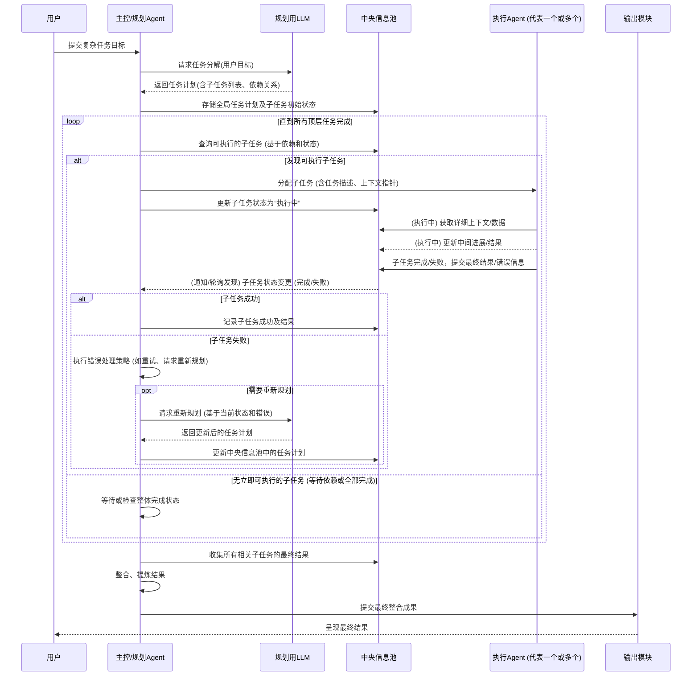

# 主控/规划Agent (Orchestrator Agent) 实施细节

主控/规划Agent是整个AI Agent系统的“大脑中枢”和“总指挥”。它负责理解用户的宏观目标，将其分解为可执行的子任务，并将这些子任务分配给执行Agent，同时监控整个任务的执行流程，处理意外情况，最终汇总结果。

## 核心职责与功能模块

1.  **用户指令接口 (User Command Interface):**
    *   接收来自用户的原始、高层次的任务指令或目标。
    *   对用户指令进行初步的理解和标准化处理。

2.  **任务规划模块 (Task Planning Module):**
    *   **与规划用LLM交互 (PlannerLLM Interaction):**
        *   将标准化的用户目标传递给专门的规划用LLM (PlannerLLM)。
        *   PlannerLLM负责将宏观目标分解为一系列具体的、结构化的子任务。这些子任务可能存在依赖关系（例如，任务B必须在任务A完成后才能开始）或可以并行执行。
        *   接收PlannerLLM返回的任务计划（例如，一个有向无环图 (DAG) 或有序列表，其中包含每个子任务的描述、目标和潜在的输入/输出）。
    *   **任务计划管理 (Task Plan Management):**
        *   在中央信息池中存储和维护这个全局任务计划。
        *   记录每个子任务的ID、描述、依赖项、当前状态（如：待分配、已分配、执行中、已完成、失败）、负责人（哪个执行Agent）、输入/输出参数等。

3.  **任务调度与分配模块 (Task Scheduling & Dispatching Module):**
    *   **依赖分析 (Dependency Analysis):** 根据任务计划中的依赖关系，识别当前哪些子任务是“就绪”状态（即其所有前置依赖任务均已完成）。
    *   **执行Agent选择 (Execution Agent Selection):**
        *   维护一个可用的执行Agent列表及其当前状态（空闲、忙碌）。
        *   根据子任务的特性（如果未来支持特定类型的执行Agent）和执行Agent的负载情况，选择一个合适的空闲执行Agent。
    *   **任务分派 (Task Dispatching):**
        *   将就绪的子任务及其必要的上下文信息（例如，指向中央信息池中相关数据的指针）发送给选定的执行Agent。
        *   更新中央信息池中该子任务的状态为“已分配”或“执行中”。

4.  **执行监控与状态管理模块 (Execution Monitoring & State Management Module):**
    *   **中央信息池轮询/订阅 (Central Info Pool Polling/Subscription):**
        *   定期检查或通过订阅机制从中央信息池获取各个子任务的最新状态和执行Agent提交的中间/最终结果。
    *   **进度跟踪 (Progress Tracking):** 监控整体任务的完成百分比、剩余任务等。
    *   **超时与错误检测 (Timeout & Error Detection):**
        *   为子任务设置执行超时。
        *   检测执行Agent报告的错误状态。

5.  **异常处理与决策模块 (Exception Handling & Decision Making Module):**
    *   **错误处理 (Error Handling):**
        *   当子任务执行失败时，根据预设策略进行处理：
            *   **重试 (Retry):** 允许子任务在同一或不同执行Agent上重试若干次。
            *   **替代方案 (Alternative Path):** 如果任务计划中包含备选执行路径，则激活备选路径。
            *   **重新规划 (Re-planning):** 如果错误较为严重或影响后续计划，可能需要再次调用PlannerLLM，基于当前状态和错误信息重新规划剩余任务。
            *   **用户介入 (User Intervention):** 对于无法自动解决的严重错误，向用户报告并请求指示。
    *   **动态调整 (Dynamic Adjustment):** 根据执行过程中的实际情况（例如，某个信息源不可用），可能需要动态调整任务计划。

6.  **结果整合与输出模块 (Result Aggregation & Output Module):**
    *   **子任务结果收集 (Sub-task Result Collection):** 当所有构成一个高级别任务或最终目标的子任务都成功完成后，从中央信息池收集它们的最终结果。
    *   **结果整合与提炼 (Result Consolidation & Refinement):**
        *   可能需要对来自不同子任务的结果进行合并、去重、排序、总结或进一步处理，以形成一个连贯的、满足用户原始目标的最终答案。
        *   此过程可能也需要调用LLM进行辅助。
    *   **交付最终成果 (Final Output Delivery):** 将处理完毕的最终结果传递给输出模块，呈现给用户。

## 主控/规划Agent 工作流程时序图

以下时序图展示了主控/规划Agent在处理一个用户请求时的主要交互流程：

**时序图说明:**

*   **用户提交任务:** 流程始于用户向主控/规划Agent提交一个复杂的任务目标。
*   **任务规划:** 主控/规划Agent调用规划用LLM将目标分解为子任务，并将计划存入中央信息池。
*   **主循环 (任务调度与监控):**
    *   主控/规划Agent持续检查中央信息池，寻找可以执行的子任务（即依赖已满足）。
    *   一旦找到，便将其分配给一个可用的执行Agent，并更新子任务状态。
    *   执行Agent在执行过程中可能会与中央信息池交互（获取数据、更新进展）。
    *   执行Agent完成后，将其结果或错误状态更新到中央信息池。
    *   主控/规划Agent通过监控中央信息池得知子任务的完成或失败。
*   **错误处理与重新规划:** 如果子任务失败，主控/规划Agent会启动错误处理流程，这可能包括请求规划用LLM进行重新规划。
*   **结果汇总与输出:** 当所有必要的子任务都成功完成后，主控/规划Agent从中央信息池收集结果，进行整合提炼，并通过输出模块呈现给用户。
