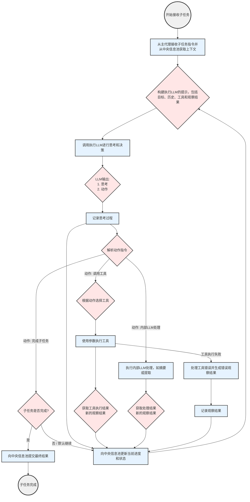

# 任务执行阶段 (执行Agent) 实施细节

执行Agent是AI Agent系统中负责“动手”完成具体子任务的单元。它接收来自主控/规划Agent的明确指令（子任务），并通过内部的执行用LLM (ExecutorLLM) 进行思考、决策，调用工具库中的工具与环境交互，最终产出结果。其核心是迭代式的“思考-行动-观察”循环。

## 核心组件与能力

1.  **子任务接收与上下文理解模块 (Sub-task Reception & Context Understanding Module):**
    *   从主控/规划Agent接收子任务描述、目标、以及指向中央信息池中相关上下文数据（如先前步骤的结果、共享文件等）的指针。
    *   加载并理解子任务的具体要求和可用资源。

2.  **执行用LLM (ExecutorLLM):**
    *   作为执行Agent的“大脑”，负责在每一步进行推理和决策。
    *   输入包括：当前子任务目标、历史行动记录、先前观察结果、可用的工具列表及其描述、从中央信息池获取的上下文。
    *   输出包括：
        *   **思考 (Thought):** 对当前情况的分析以及选择下一步行动的理由。
        *   **行动 (Action):** 具体要执行的动作，如调用哪个工具并传入什么参数，或者进行内部信息处理。

3.  **工具调用与管理模块 (Tool Invocation & Management Module):**
    *   维护一个可用的**工具库 (ToolLibrary)** 的接口。工具库包含一系列预定义的函数、API客户端或脚本，用于执行具体操作。
    *   根据ExecutorLLM输出的行动指令，准确地调用相应的工具并传递参数。
    *   处理工具执行的返回结果（成功数据或错误信息）。
    *   **工具列表 (示例):**
        *   `web_search(query: str, num_results: int = 3) -> List[SearchResult]`
        *   `browse_webpage(url: str, selectors: Optional[List[str]] = None) -> str` (返回页面内容或特定元素内容)
        *   `code_interpreter(code: str, language: str = "python") -> CodeOutput` (执行代码并返回输出/错误)
        *   `file_read(path: str) -> str`
        *   `file_write(path: str, content: str) -> bool`
        *   `summarize_text(text: str, max_length: Optional[int] = None) -> str` (可能由LLM直接实现)
        *   `extract_entities(text: str, entity_types: List[str]) -> Dict[str, List[str]]` (可能由LLM直接实现)

4.  **状态与历史记录器 (State & History Logger):**
    *   记录执行Agent在处理当前子任务过程中的每一步：
        *   接收到的子任务。
        *   每一轮的思考 (Thought)。
        *   每一轮的行动 (Action) 及参数。
        *   每一轮的观察 (Observation) 结果。
        *   遇到的任何错误。
    *   这些历史记录对于LLM的后续决策至关重要，也用于调试和向中央信息池报告进展。

5.  **与中央信息池的通信模块 (Central Info Pool Communication Module):**
    *   从中央信息池获取子任务所需的初始上下文和数据。
    *   将执行过程中的关键中间结果、状态更新、遇到的问题以及子任务的最终结果（或失败报告）写回中央信息池。

## 执行Agent 工作流程图 (ReAct 模式)

以下流程图详细展示了执行Agent内部的“思考-行动-观察”迭代循环：

**流程图步骤说明:**

1.  **开始接收子任务 (Start):** 执行Agent被主控/规划Agent激活，并接收到一个具体的子任务指令。
2.  **获取子任务上下文 (GetSubTaskContext):** 从主控Agent的指令中解析任务目标，并从中央信息池获取该子任务所需的任何背景信息、先前步骤产生的数据等。
3.  **构建Prompt给执行用LLM (PromptLLM):** 准备一个完整的Prompt，作为执行用LLM的输入。这个Prompt通常包含：
    *   **当前子任务的明确目标。**
    *   **到目前为止的行动历史和观察结果** (对于后续迭代)。
    *   **可用的工具列表及其功能描述和使用方法。**
    *   **任何相关的上下文数据。**
4.  **调用执行用LLM进行思考与决策 (InvokeLLM):** 将构建好的Prompt发送给ExecutorLLM。
5.  **LLM输出 (LLMOutput):** LLM返回其输出，理想情况下包含两部分：
    *   **思考 (Thought):** LLM的推理过程，解释它为什么打算采取接下来的行动。
    *   **行动 (Action):** 一个结构化的指令，指明要执行的具体操作。
6.  **记录思考过程 (LogThought):** 将LLM的“思考”部分记录到内部历史中。
7.  **解析行动指令 (ParseAction):** 分析LLM输出的“行动”部分，判断是需要调用外部工具、进行LLM内部处理，还是任务已完成。
8.  **行动: 调用工具 (SelectTool -> ExecuteTool -> ToolResult):**
    *   如果行动是调用工具，执行Agent会选择正确的工具，并传入LLM指定的参数来执行它。
    *   工具执行后会返回一个结果（成功数据或错误信息），这构成了新的“观察 (Observation)”。
    *   **处理工具错误 (HandleToolError):** 如果工具执行失败，将错误信息格式化为一个“观察”，以便LLM在下一轮可以感知到错误并尝试纠正。
9.  **行动: 内部LLM处理 (InternalLLMProcess -> LLMProcessResult):**
    *   如果行动是利用LLM自身能力处理信息（如文本总结、信息提取，而不是调用外部工具），则执行相应的内部处理。
    *   处理结果也构成新的“观察”。
10. **记录观察结果 (LogObservation):** 将从工具或内部处理中获得的“观察”记录到内部历史中。
11. **行动: 完成子任务 (TaskComplete):**
    *   如果LLM判断当前子任务已经完成，并输出了相应的“完成”行动。
    *   **将最终结果提交至中央信息池 (SubmitResultToCIP):** 将子任务的最终成果（或失败状态）报告给中央信息池。
    *   **子任务结束 (End):** 执行Agent结束当前子任务的处理。
12. **向中央信息池更新当前进展/状态 (UpdateCIPProgress):** 如果任务未完成，将当前的进展（例如，最后一次行动和观察）更新到中央信息池，以便主控Agent可以监控。
13. **迭代:** 流程返回到**构建Prompt给执行用LLM (PromptLLM)**，开始新一轮的思考-行动-观察循环，LLM会基于最新的观察结果来规划下一步。
